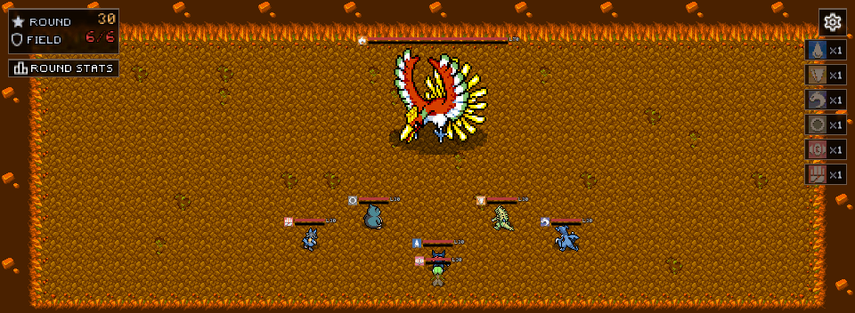

# Pokemon Tactics

[](https://github.com/lthiagovs/PokemonTatics/actions/workflows/ci.yml)
[](LICENSE)

A Pokémon auto-battler made with MonoGame. Buy Pokémon in the shop, place them on
your side of the board and press `START`: the fight plays out on its own, and every
round is harder than the last.



## Download

Grab the latest zip for Windows or Linux from
[Releases](https://github.com/lthiagovs/PokemonTatics/releases), extract it and run
`PokemonTFT` (on Linux, `chmod +x PokemonTFT` first). Nothing else to install.

## Build from source

Requires the [.NET 9 SDK](https://dotnet.microsoft.com/download) and Python 3.9+.
Pokémon sprites are not in the repository, so download the ones the roster uses
once before running:

```bash
pip install Pillow
python tools/pokemon_assets.py sprites
dotnet run
```

`dotnet test` runs the test suite (roster, items, balance rules and headless
battles). Pushing a `v*` tag builds the release zips through GitHub Actions.

`dotnet run -- --demo <folder>` plays a scripted fight against a Ho-Oh boss and saves
its frames to the folder; it is how the GIF above was recorded.

## Roster

`Data/pokemons.xml` holds the roster and can be edited or replaced. The importer
pulls stats from [PokéAPI](https://pokeapi.co) and sprites from
[PMD Sprite Collab](https://sprites.pmdcollab.org); run it without arguments for an
interactive menu.

The game derives the rest at startup: cost from the base stat total, evolution level
from how much stronger the next form is, and the fighting style. Legendaries are
never sold; they only appear as bosses.

## How to play

| Action | Input |
| --- | --- |
| Buy a Pokémon | Left click a shop card |
| Place or pick up | Left click a tile in your rows |
| Sell what you hold | Right click |
| Inspect a Pokémon | Right click it |
| Reroll the shop | `REROLL` (twice per round) |
| Start the round | `START` |
| Options | `OPTIONS` on the title screen, or the gear in a run |

- Buying a Pokémon you already own gives it XP.
- The field gains a slot every 5 rounds, up to two thirds of your tiles.
- Two or more Pokémon of one type give the whole team that type's bonus.
- Every 10th round a legendary boss appears and always drops an item.
- Hovering a Pokémon shows its reach: green tiles get its buff, red tiles are hit by
  its special.

## Styles

| Style | Behaviour |
| --- | --- |
| FIGHTER | charges the nearest foe |
| PHYSICAL TANK | protects the team and taunts nearby foes |
| MAGIC TANK | holds a zone and shields allies around it |
| EVASION TANK | dives the back line and dodges while moving |
| MAGE | snipes the weakest foe from range |
| MAGIC FIGHTER | blasts the tightest group of foes |
| BALANCED | flanks foes busy fighting someone else |

## Difficulty

Chosen in the options and saved with the other settings. It sets how often the shop
guarantees a card of a Pokémon already on your field: every round on EASY, every 3
rounds on MEDIUM and every 6 rounds on HARD.

## Project layout

```
Core/      engine, rendering, UI, board and shop
Logic/     combat, tactics, encounters and Balance.cs
Models/    Pokémon, items and the type chart
Data/      roster, items, dungeons and their loaders
Screens/   title, evolution and game over
tools/     asset import scripts
```

All balance numbers live in `Logic/Balance.cs`.

## How it works

- Each fighting style has its own tactic: who it targets, how it moves and one trait
  (a charge, a taunt, an aura, hit-and-run, a blink back, a sidestep or a flank).
- Enemies are drawn around a power target that rises every round, taking evolutions
  into account, so difficulty climbs without sudden walls.
- The balance was tuned with a headless simulator that runs the real combat and
  tactics code over thousands of games and style duels.

## License

The code is under the [MIT license](LICENSE). Sprites, data, art and the font keep
their own terms, listed in [THIRD_PARTY.md](THIRD_PARTY.md): the sprites are
[CC BY-NC 4.0](https://creativecommons.org/licenses/by-nc/4.0/) by the
[PMD Sprite Collab](https://sprites.pmdcollab.org) community, so no build may be
sold. Pokémon is a trademark of Nintendo / Game Freak / The Pokémon Company; this
is a non-commercial fan project.
